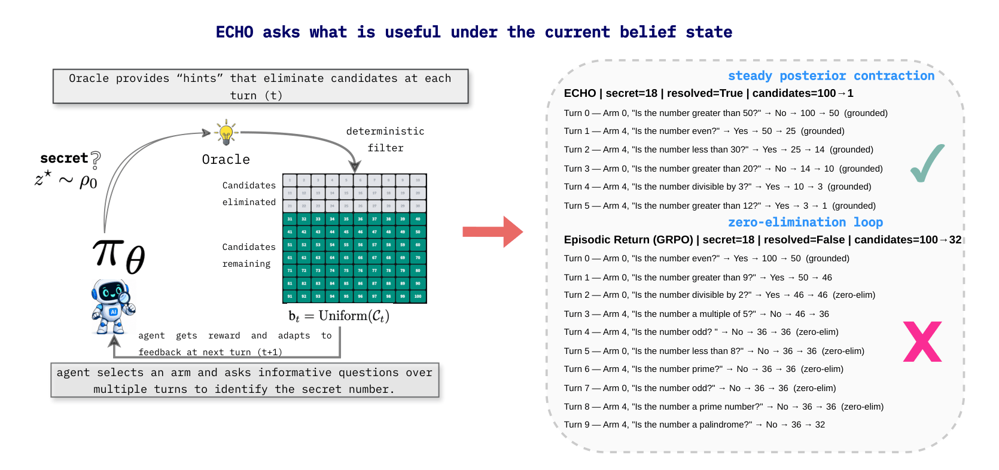
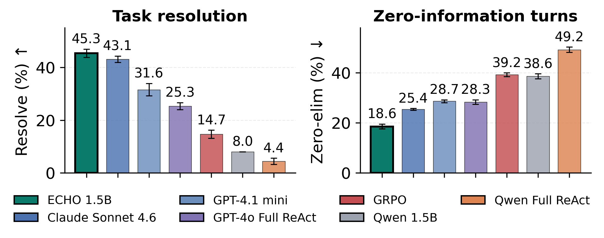
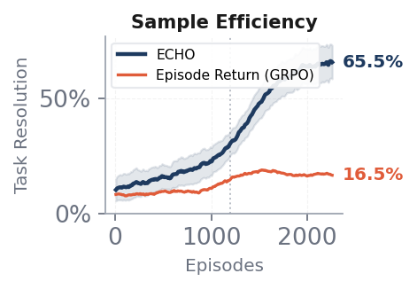

# echo-edp
Code for ECHO preprint— experiments conducted February–April 2026 at Signal Lab, Colorado State University

## Overview



ECHO (Epistemic Credit for History-Conditioned Optimization) trains a policy $\pi_\theta$ (shown in the figure above) to adaptively seek information through multi-turn interaction. The key idea: normalize rewards at each turn depth across parallel rollouts of the same problem, giving a belief-state-aware credit signal without explicit value estimation or reasoning traces.

The testbed is the **Clue Selector Game (CSG)** — a 5-arm bandit where the agent asks property questions to identify a secret number. Belief state is the remaining candidate set; the oracle is GPT-4o-mini.

## Results

ECHO-trained Qwen 2.5 (1.5B) matches frontier-level task resolution on the CSG while producing fewer zero-elimination turns and learning 4× faster than standard GRPO. The key: epistemic credit rewards actions that reduce belief-state uncertainty at each turn, not only when the final trajectory succeeds.

<p align="center">
  
  
</p>

---

## Files

| File | Description |
|---|---|
| `prompts.py` | Prompt templates for the selector and oracle |
| `environment.py` | CSG environment: oracle, belief update (`filter_candidates`), arm properties |
| `advantages.py` | ECHO advantage computation + baselines (episode-return, RLOO per-turn) |
| `train_echo.py` | ECHO training — LoRA fine-tuning of Qwen2.5-1.5B with online rollouts |
| `eval.py` | Evaluation runner for trained, base, and frontier models |
| `results.py` | Per-stratum metrics from the HuggingFace dataset |

---

## Setup

```bash
pip install torch transformers trl peft datasets openai anthropic python-dotenv
```

Create a `.env` file:

```
OPENAI_API_KEY=sk-...      # for GPT-4o-mini oracle (required for all runs)
CLAUDE_API_KEY=sk-ant-...  # only needed for Claude frontier eval
```

---

## Training

```bash
# single seed
python train_echo.py --steps 350 --model Qwen/Qwen2.5-1.5B-Instruct

# multi-seed (paper uses seeds 42, 123, 7)
python train_echo.py --seeds 42 123 7 --steps 350
```

Checkpoints saved to `clue_grpo_echo/` with a `manifest.json`.

---

## Evaluation

```bash
# evaluate trained ECHO checkpoint
python eval.py --model-type trained --checkpoint clue_grpo_echo/<run>/final_model

# evaluate a base Qwen model
python eval.py --model-type base --model-id Qwen/Qwen2.5-7B-Instruct

# evaluate a frontier model
python eval.py --model-type frontier --model-name gpt-4o

# print tables from existing results
python eval.py --print-only
```

Results saved to `eval_results/per_target/`.

---

## Dataset and Results

The evaluation dataset and all episode logs are available on HuggingFace. To reproduce the per-stratum results table from the paper:

```bash
python results.py   # run from a machine with pyarrow installed
```

---

## Citation
 
